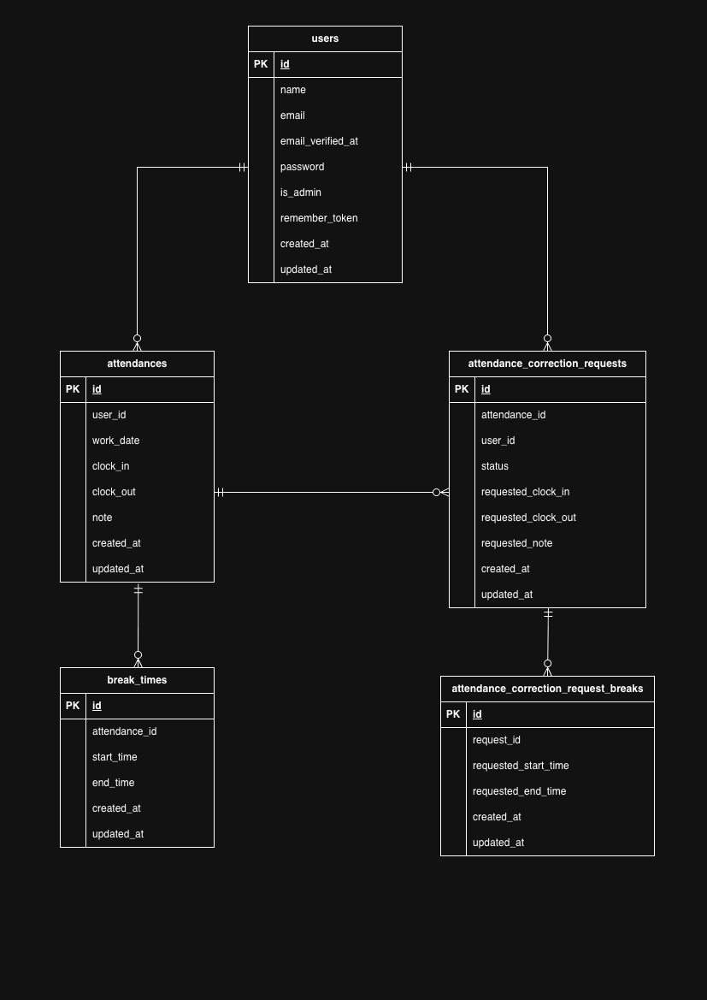

# 勤怠アプリ

## 環境構築

### Dockerビルド

1. `git clone https://github.com/maho756/attendance-app.git`
2. `cd attendance-app`
3. `docker-compose up -d --build`

---

### Laravel環境構築

1. `docker-compose exec php bash`
2. `composer install`
3. `cp .env.example .env`
   ※ DB_HOST=mysql になっていることを確認
4. `php artisan key:generate`
5. `php artisan migrate`
6. `php artisan db:seed`

---

## ログイン情報

### 管理者ユーザー
- Email：admin@example.com
- Password：password

### 一般ユーザー
※以下のいずれかでログイン可能（全員パスワード共通）

- yamada@example.com / password
- nishi@example.com / password
- masuda@example.com / password
- yamamoto@example.com / password
- akita@example.com / password
- nakanishi@example.com / password

---

## 使用技術（実行環境）
- Docker / Docker Compose
- PHP 8.1.34
- Laravel 8.83.8
- MariaDB 11.8.3
- Nginx 1.21.1
- MailHog

---

## URL
- 開発環境：http://localhost/
- phpMyAdmin：http://localhost:8080/
- MailHog：http://localhost:8025/

---

## ER図
